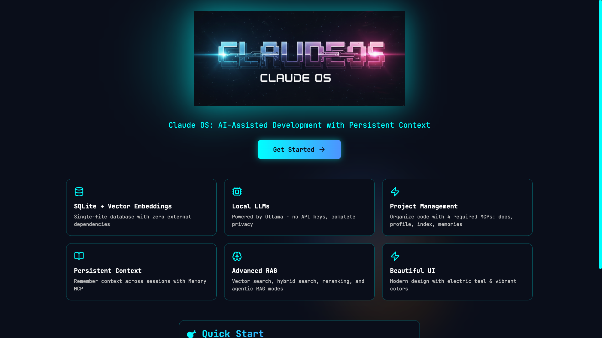
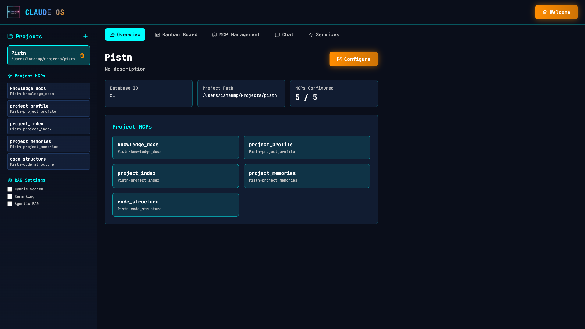
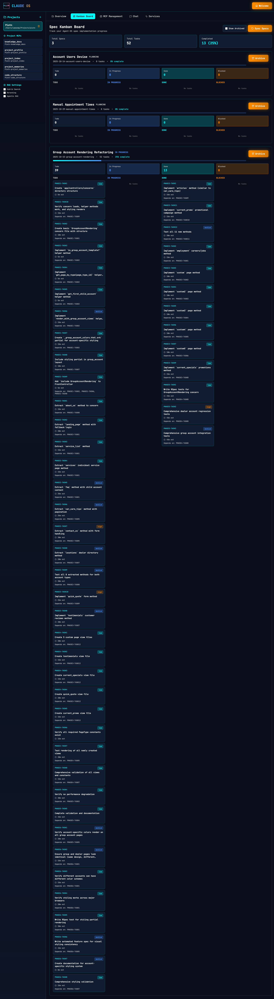
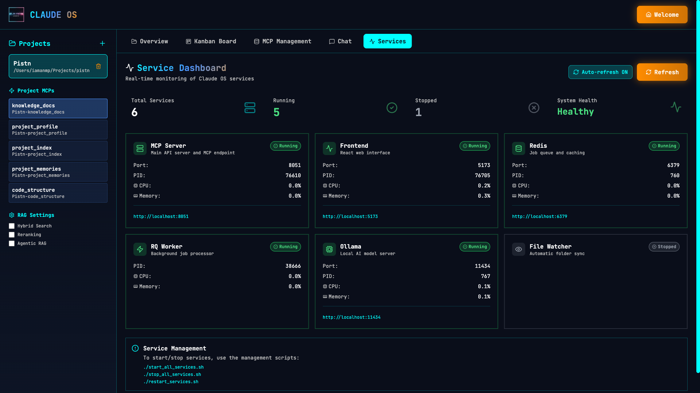

# Claude OS

<p align="center">
  
</p>

<p align="center">
  <strong>AI Memory & Knowledge Base System for Claude Code</strong><br>
  Initialize projects in seconds • Never lose context again
</p>

<p align="center">
  <a href="#license"></a>
  <a href="https://www.python.org/downloads/"></a>
  <a href="https://www.sqlite.org/"></a>
  <a href="https://ollama.ai/"></a>
</p>

<p align="center">
  <a href="https://thebob.dev/claude-os/">
    
  </a>
</p>

---

## 🚀 What is Claude OS?

**Claude OS** is **Claude Code's personal memory system** - making AI the best coding assistant in the universe by remembering everything across sessions.

### The Problem

You work with Claude Code on a feature, close the terminal, come back tomorrow... and Claude forgot everything. You explain the same architecture. You reference the same files. You repeat yourself constantly.

### The Solution

**Claude OS gives Claude persistent memory:**

- 📝 **Remembers decisions** across all sessions
- 🔍 **Searches past work** automatically at session start
- 📚 **Indexes your docs** and makes them searchable
- 🧠 **Learns patterns** that improve over time
- 🔄 **100% Local** - Never leaves your machine, fully private

### Key Features

✅ **Lightning-Fast Indexing** - NEW! Tree-sitter hybrid indexing: 10,000 files in 30 seconds (vs 3-5 hours)
✅ **Real-Time Kanban Board** - NEW! Auto-syncing task visualization for agent-os specs (updates within 3 seconds)
✅ **One-Command Project Init** - `/claude-os-init` and you're done
✅ **Automatic Context Loading** - Starts every session with relevant memories
✅ **Session Management** - Track work, save progress, resume later
✅ **Documentation Ingestion** - Auto-indexes your docs during setup
✅ **Agent-OS Integration** - Optional spec-driven development with 8 specialized agents
✅ **Flexible AI** - Choose local Ollama (free) or OpenAI API (paid)
✅ **Template System** - Commands and skills shared via symlinks

---

## ⚡ NEW: Hybrid Indexing System

**Claude OS v2.0 introduces lightning-fast tree-sitter based indexing!**

### The Problem with Traditional Indexing

Previous versions embedded EVERY file, which was painfully slow for large codebases:

- **Large projects (10,000+ files):** 3-5 hours to index
- Must complete before Claude can start working
- High resource usage, blocks productive coding

### The Solution: Hybrid Two-Phase Indexing

Inspired by [Aider's](https://github.com/Aider-AI/aider) approach, Claude OS now uses:

**Phase 1: Structural Index (30 seconds)**

- ⚡ Parse files with tree-sitter (no LLM calls!)
- 📊 Extract symbols only (classes, functions, signatures)
- 🔗 Build dependency graph
- 🏆 PageRank importance scoring
- ✅ Ready to code immediately!

**Phase 2: Semantic Index (optional, background)**

- 🎯 Selective embedding (top 20% most important files)
- 📚 Full embedding for documentation
- 🔍 Deep semantic search when needed
- ⏰ Runs in background while you code

### Performance Comparison

| Feature | Before | After (Hybrid) |
|---------|--------|----------------|
| **Large project (10k files)** | 3-5 hours | **30 seconds** + 20 min optional |
| **Files embedded** | 100,000+ chunks | ~20,000 chunks (80% reduction) |
| **Start coding** | After full index | **Immediately!** |
| **Resource usage** | High Ollama load | Minimal CPU/memory |
| **Query speed** | Semantic search | Instant structural + semantic |

📖 **Read the full design:** [docs/HYBRID_INDEXING_DESIGN.md](docs/HYBRID_INDEXING_DESIGN.md)

---

## 🎨 Visual Interface

**Claude OS provides a beautiful, intuitive web interface for managing your AI development workflow:**

<table>
<tr>
<td width="50%">

### Welcome Screen


Get started with Claude OS

</td>
<td width="50%">

### Project Overview


View project details and MCP status

</td>
</tr>
<tr>
<td width="50%">

### Kanban Board


Track spec implementation progress

</td>
<td width="50%">

### Services Dashboard


Monitor all Claude OS services

</td>
</tr>
</table>

**📖 See the complete visual guide:** [docs/guides/VISUAL_GUIDE.md](docs/guides/VISUAL_GUIDE.md)

---

## 🏗️ Architecture Overview

<p align="center">
  
</p>

**Claude OS is built on 5 core pillars that work together to give Claude persistent memory:**

1. **🧠 Real-Time Learning** - Automatically captures insights from conversations via Redis Pub/Sub
2. **💾 Memory MCP** - Persistent memory system with instant recall using natural language
3. **🔍 Analyze-Project** - Intelligent codebase indexing with git hooks and tree-sitter
4. **🎯 Session Management** - Auto-resume sessions with full context preservation
5. **📚 Semantic Search** - Vector-based code understanding and pattern recognition

All knowledge flows through the **Semantic Knowledge Base** (SQLite + sqlite-vec), exposed via the **MCP Server** (port 8051) to **Claude Code**, giving you an AI assistant that never forgets.

**Data Flow:** `Git Commit → 3s indexing → SQLite → MCP → Claude → You`

---

## 💻 Installation & Setup

### Prerequisites

**Required:**

- macOS or Linux (Ubuntu, Debian, Fedora, RHEL, Arch)
- Python 3.11 or 3.12 (`python3 --version`)
  - **Note:** Python 3.13+ not yet supported due to dependency constraints
- Git (`git --version`)

**Optional:**

- Node.js 16+ (for React UI)
- Ollama (for local AI) or OpenAI API key

> **Note:** Windows support coming soon.

### Quick Installation

```bash
# Clone the repository
git clone https://github.com/brobertsaz/claude-os.git
cd claude-os

# Run the installer
./install.sh
```

The installer will:

- ✅ Set up Python virtual environment
- ✅ Install all dependencies
- ✅ Configure MCP server
- ✅ Symlink commands and skills to `~/.claude/`
- ✅ Create start script

### Full Setup (with Ollama)

If you want to use local AI with Ollama:

```bash
# 1. Clone the repository
git clone https://github.com/brobertsaz/claude-os.git
cd claude-os

# 2. Run the full setup script (installs Ollama + Redis)
./setup.sh

# 3. Start all services
./start_all_services.sh
```

**The setup script automatically installs:**

- ✅ Ollama (if not present) + LLM models
- ✅ Redis (if not present) for caching/queues
- ✅ Python virtual environment
- ✅ All Python dependencies
- ✅ SQLite database
- ✅ Frontend dependencies (if Node.js present)

**Visit** <http://localhost:5173> to use the web UI.

### Starting Claude OS

After installation, start the services:

```bash
./start.sh
```

This starts the MCP server at `http://localhost:8051`

---

## 🚀 Quick Start

**Initialize any project with Claude OS in under 2 minutes:**

### Step 1: Navigate to Your Project

```bash
cd /path/to/your/project
```

### Step 2: Initialize with Claude OS

In Claude Code, run:

```
/claude-os-init
```

The command will:

1. **Ask Questions Interactively:**
   - Project name (auto-detects from folder)
   - Tech stack (Ruby on Rails, Python, Node.js, etc.)
   - Database (PostgreSQL, MySQL, etc.)
   - Development environment (Docker, Local, etc.)
   - Brief description
   - Documentation directory to ingest (optional)

2. **Create Project in Claude OS:**
   - Calls API to create project
   - Creates 4 knowledge bases automatically:
     - `{project}-project_memories` - Claude's memory
     - `{project}-project_profile` - Architecture & standards
     - `{project}-project_index` - Codebase index
     - `{project}-knowledge_docs` - Your documentation

3. **Set Up Project Structure:**

   ```
   your-project/
   ├── CLAUDE.md           # Auto-loaded every session!
   ├── .claude/            # Commands, skills, agents
   │   ├── ARCHITECTURE.md
   │   ├── CODING_STANDARDS.md
   │   └── DEVELOPMENT_PRACTICES.md
   └── .claude-os/         # Config and state (git-ignored)
       ├── config.json
       └── hooks.json
   ```

4. **Ingest Documentation:**
   - Scans your docs directory
   - Uploads all files to `{project}-knowledge_docs`
   - Creates vector embeddings for search

5. **Analyze Codebase:**
   - Runs `initialize-project` skill
   - Generates coding standards
   - Documents architecture
   - Indexes key files

6. **Ready to Code:**
   - Claude now knows your project
   - Memory persists across sessions
   - Context auto-loads on session start

### What You Get

- ✅ 4 knowledge bases created (memories, profile, index, docs)
- ✅ Documentation auto-indexed
- ✅ Codebase analyzed
- ✅ CLAUDE.md file with all context
- ✅ Ready to code with AI memory!

---

## 🧠 How Claude OS Works

### Session Workflow

**Every Claude Code session automatically:**

1. **Checks for Active Session**
   - Reads `claude-os-state.json`
   - Prompts: Continue working? Start something new?

2. **Loads Context**
   - Searches `{project}-project_memories` for recent work
   - Loads relevant patterns and decisions
   - Shows what it remembers

3. **Works With Memory**
   - Saves insights with `/claude-os-remember`
   - Searches memories with `/claude-os-search`
   - References past decisions automatically

4. **Ends Session**
   - Saves session summary
   - Updates memories
   - Tracks what was accomplished

### Available Commands

All these work in any initialized project:

- **`/claude-os-init`** - Initialize new project
- **`/claude-os-search [query]`** - Search memories & docs
- **`/claude-os-remember [content]`** - Quick save to memories
- **`/claude-os-save [title]`** - Full-featured save with KB selection
- **`/claude-os-list`** - List all knowledge bases
- **`/claude-os-session [action]`** - Manage development sessions
- **`/claude-os-triggers`** - Manage trigger phrases

### Available Skills

- **`initialize-project`** - Analyze codebase and generate standards
- **`remember-this`** - Auto-save when you say "remember this:"
- **`memory`** - Simple memory management

---

## 🤖 Agent-OS: Spec-Driven Development (Optional)

> **Created by [Builder Methods (CasJam Media LLC)](https://github.com/buildermethods/agent-os)**
> MIT Licensed • Separate Optional Integration

**Agent-OS adds structured workflows for planning and implementing features using 8 specialized agents.**

Agent-OS is a separate open-source project that can be installed alongside Claude OS. We're grateful to Builder Methods for creating such powerful spec-driven development tools.

### Manual Installation

If the Agent-OS repository is available, you can install it with:

```bash
git clone https://github.com/buildermethods/agent-os.git ~/.claude/agents/agent-os
```

**Note:** Check if the repository exists before attempting to install.

### When to Use Agent-OS

If you have Agent-OS installed, use it when you want:

- **Structured feature planning** with iterative requirements gathering
- **Detailed specifications** before coding
- **Task breakdowns** with clear implementation steps
- **Verification workflows** to ensure completeness

### The 8 Agents

**Specification Workflow:**

1. **`spec-initializer`** - Initialize new spec directories
2. **`spec-shaper`** - Gather requirements through 1-3 questions at a time
3. **`spec-writer`** - Create detailed technical specifications
4. **`tasks-list-creator`** - Break specs into actionable tasks

**Implementation Workflow:**

5. **`implementer`** - Implement features following task list
6. **`implementation-verifier`** - Verify implementation completeness
7. **`spec-verifier`** - Verify specs and tasks consistency
8. **`product-planner`** - Create product documentation

### Agent-OS Commands

Available when enabled:

- **`/new-spec`** - Initialize a new feature specification
- **`/create-spec`** - Full specification workflow (gather requirements → create spec → generate tasks)
- **`/plan-product`** - Create product mission, roadmap, and tech stack docs
- **`/implement-spec`** - Implement a specification following its tasks

### How It Works

```
1. User: "/new-spec user-authentication"
   → Agent creates spec directory structure

2. User: "/create-spec"
   → spec-shaper asks 1-3 questions at a time
   → Gathers requirements iteratively
   → Identifies reusable code
   → Collects visual assets

3. Agent: spec-writer creates detailed specification
   → tasks-list-creator generates actionable tasks

4. User: "/implement-spec user-authentication"
   → implementer follows tasks step-by-step
   → implementation-verifier checks completeness

5. Result: Fully specified, implemented, and verified feature!
```

### Agent-OS Project Structure

When enabled, your project gets:

```
your-project/
├── agent-os/
│   ├── config.yml          # Agent-OS configuration
│   ├── product/            # Product documentation
│   │   ├── mission.md      # Product mission
│   │   ├── roadmap.md      # Feature roadmap
│   │   └── tech-stack.md   # Technology stack
│   ├── specs/              # Feature specifications
│   │   └── YYYY-MM-DD-feature-name/
│   │       ├── planning/
│   │       │   ├── requirements.md
│   │       │   └── visuals/
│   │       ├── spec.md
│   │       └── tasks.md
│   └── standards/          # Coding standards (as skills)
└── .claude/agents/agent-os/  # 8 agents (symlinked)
```

### Integration with Claude OS

Agent-OS agents deeply integrate with Claude OS:

- **Search memories** before creating specs (avoid reinventing)
- **Save decisions** to project_memories during planning
- **Reference patterns** from previous work
- **Build knowledge** that improves over time

**This is the complete AI development system!**

---

## 🎯 Spec Tracking & Kanban Board

**NEW: Real-time auto-syncing Kanban board for Agent-OS specs!**


*Visual Kanban board showing specs, tasks, and progress tracking*

### What It Does

When you use Agent-OS to create specs with `/create-spec`, Claude OS automatically:

- 📋 **Parses tasks.md files** - Extracts all tasks, phases, dependencies, and metadata
- 🗄️ **Stores in database** - Tracks progress, completion, and time estimates
- 📊 **Displays as Kanban** - Visual board showing specs and tasks by status
- ⚡ **Real-time sync** - NEW! Auto-detects file changes and updates within 3 seconds
- 👀 **File watching** - Monitors `agent-os/specs/` folder for changes
- ✅ **Auto-refresh** - Board polls every 3 seconds for live updates
- 🗃️ **Archives completed specs** - Keep your board focused on active work

### Features

**Real-Time File Watching (NEW!):**

- Automatically monitors your `agent-os/specs/` folder
- Detects changes to `tasks.md` and `spec.md` files
- 2-second debounce to batch rapid edits
- Auto-syncs to database within 3 seconds
- Frontend auto-refreshes every 3 seconds
- **Total latency: ~6 seconds from file save to board update**

**Automatic Syncing:**

- Syncs all specs from your project's `agent-os/specs/` folder
- Tracks task metadata (estimated time, dependencies, risk level)
- Auto-detects completed tasks (marked with ✅ or `[x]` in tasks.md)
- Supports both checkbox format and classic format

**Progress Tracking:**

- **Status auto-updates** based on completion:
  - `planning` - No tasks completed yet
  - `in_progress` - Some tasks completed
  - `completed` - All tasks done
- Progress percentage calculated automatically
- Time estimates tracked (estimated vs actual minutes)

**Archive Feature:**

- Archive completed specs to keep your board clean
- Archived specs hidden by default but can be viewed
- Preserves all task history for future reference

### API Endpoints

All spec tracking functionality is exposed via REST API:

```bash
# Get all specs for a project
GET /api/projects/{project_id}/specs

# Get all tasks for a spec
GET /api/specs/{spec_id}/tasks

# Update task status
PATCH /api/tasks/{task_id}/status
{
  "status": "in_progress",  # todo, in_progress, done, blocked
  "actual_minutes": 15
}

# Sync specs from agent-os folder (manual)
POST /api/projects/{project_id}/specs/sync

# Get Kanban board view
GET /api/projects/{project_id}/kanban?include_archived=false

# Archive/unarchive specs
POST /api/specs/{spec_id}/archive
POST /api/specs/{spec_id}/unarchive

# NEW: Real-time spec watcher control
GET /api/spec-watcher/status
POST /api/spec-watcher/start/{project_id}
POST /api/spec-watcher/stop/{project_id}
POST /api/spec-watcher/start-all
```

**See:** `docs/guides/REALTIME_KANBAN_GUIDE.md` for complete documentation.

### How It Works

```
1. You create a spec with Agent-OS:
   /create-spec → agent-os/specs/2025-01-15-user-auth/

2. Spec Watcher detects the new folder:
   - Auto-starts when MCP server boots
   - Monitors agent-os/specs/ directory
   - 2-second debounce for batch changes

3. Auto-sync to database:
   - Reads tasks.md
   - Parses checkbox format: - [x] Task title
   - Extracts metadata, tasks, phases
   - Stores in SQLite database
   - ✅ Completes within 3 seconds

4. View in Kanban board (auto-refreshes every 3 seconds):
   - Todo: PHASE1-TASK1, PHASE1-TASK2
   - In Progress: PHASE2-TASK1
   - Done: PHASE1-TASK3, PHASE1-TASK4

5. As you work, agent-os updates tasks.md:
   - File watcher detects change
   - Auto-syncs to database
   - Board refreshes automatically
   - Total latency: ~6 seconds

6. Archive when complete:
   - Mark spec as archived
   - Keeps history but cleans up board
```

### Database Schema

Two new tables track specs and tasks:

**`specs` table:**

- Stores spec metadata (name, path, status)
- Tracks total/completed tasks
- Calculates progress percentage
- Archive flag to hide completed specs

**`spec_tasks` table:**

- Individual tasks with codes (PHASE1-TASK1)
- Status (todo/in_progress/done/blocked)
- Time tracking (estimated vs actual)
- Dependencies between tasks
- Risk levels and phases

### Example Usage

```bash
# Sync all specs for your project
curl -X POST http://localhost:8051/api/projects/1/specs/sync

# Response:
{
  "synced": 3,
  "updated": 0,
  "total": 3,
  "errors": []
}

# Get Kanban view
curl http://localhost:8051/api/projects/1/kanban

# Response shows:
# - Your specs with tasks
# - Tasks grouped by status
# - Progress percentages
# - Time estimates
```

**This is the complete AI development system!**

---

## 📂 Template System

```
claude-os/
├── templates/              # Shared templates
│   ├── commands/          # Slash commands (symlinked to ~/.claude/)
│   │   ├── claude-os-init.md
│   │   ├── claude-os-search.md
│   │   └── ...
│   ├── skills/            # Skills (symlinked to ~/.claude/)
│   │   ├── initialize-project/
│   │   ├── remember-this/
│   │   └── memory/
│   └── project-files/     # Files created during /claude-os-init
│       ├── CLAUDE.md.template
│       └── .claude-os/
│           ├── config.json.template
│           └── hooks.json.template
├── cli/                   # CLI tools
│   └── claude-os-consolidate.sh
├── install.sh             # Quick setup script
└── start.sh               # Start services
```

**Benefits:**

- ✅ Update once, all projects benefit
- ✅ Symlinks mean instant updates
- ✅ Consistent across projects

---

## 📚 Managing Knowledge Bases

### Via Web UI

1. **Visit** <http://localhost:5173>
2. **Create Knowledge Base:**
   - Click "Create Knowledge Base"
   - Choose type (Generic, Code, Documentation, Agent_OS)
3. **Upload Documents:**
   - Select KB from dropdown
   - Drag & drop files or click upload
   - Supports .md, .txt, .pdf, .py, .js, .ts, .json, .yaml
4. **Query:**
   - Type question in search box
   - View answer with source citations

### Via CLI

```bash
# Search your project memories
/claude-os-search "how did we implement authentication?"

# Save a quick insight
/claude-os-remember "Fixed bug in user controller by adding validation"

# Full-featured save
/claude-os-save "Authentication Pattern" my-app-project_profile Architecture
```

### Auto-Created KBs

When you run `/claude-os-init`, you get 4 knowledge bases:

1. **`{project}-project_memories`**
   - Claude's memory for decisions, patterns, solutions
   - Automatically saved during sessions
   - Searched at session start

2. **`{project}-project_profile`**
   - Architecture, coding standards, practices
   - Generated by `initialize-project` skill
   - Updated as project evolves

3. **`{project}-project_index`**
   - Automated codebase index
   - Tracks file structure
   - Updates on git commits (with hooks)

4. **`{project}-knowledge_docs`**
   - Your documentation
   - Auto-ingested during init
   - Add more via UI or CLI

---

## ⚙️ Configuration

### Environment Variables

```bash
# SQLite Database
SQLITE_DB_PATH=data/claude-os.db  # Default: data/claude-os.db

# Ollama
OLLAMA_HOST=http://localhost:11434  # Default: localhost:11434
OLLAMA_MODEL=llama3.1:latest        # Default: llama3.1:latest

# MCP Server
MCP_SERVER_HOST=0.0.0.0         # Default: 0.0.0.0
MCP_SERVER_PORT=8051            # Default: 8051
```

### Project Configuration

Each project has `.claude-os/config.json`:

```json
{
  "project_name": "my-app",
  "claude_os_url": "http://localhost:8051",
  "knowledge_bases": {
    "memories": "my-app-project_memories",
    "profile": "my-app-project_profile",
    "index": "my-app-project_index",
    "docs": "my-app-knowledge_docs"
  },
  "docs_settings": {
    "watch_paths": ["./docs", "./knowledge_docs"],
    "auto_ingest_patterns": ["*.md", "*.txt", "*.pdf"]
  },
  "tech_stack": "Ruby on Rails",
  "database": "MySQL"
}
```

---

## 📊 Performance

**Native Ollama Setup:**

- Response time: ~40 seconds per query
- GPU acceleration: Full Metal GPU on Apple Silicon
- Memory usage: 8-10GB (models + context)
- CPU usage: 12 cores (M4 Pro)

**Why it's fast:**

- Direct GPU acceleration (no virtualization)
- Efficient vector search in SQLite
- Optimized RAG engine with caching
- Single-file database with minimal overhead

---

## 🛠️ Scripts Guide

### Installation & Setup

#### `./install.sh` - Quick Setup (macOS & Linux)

```bash
./install.sh
```

**Automated setup script:**

- ✅ Creates `~/.claude/` directories
- ✅ Symlinks all commands and skills
- ✅ Sets up Python environment
- ✅ Installs dependencies
- ✅ Configures MCP server

**Supported Linux distros:** Ubuntu, Debian, Fedora, RHEL, Arch

#### `./setup.sh` - Full Setup (with Ollama + Redis)

```bash
./setup.sh
```

**Complete installation:**

- ✅ Installs Ollama + Redis (if not already installed)
- ✅ Downloads LLM models (~5-10 GB)
- ✅ Sets up Python environment
- ✅ Creates database

**Linux package managers supported:** apt (Debian/Ubuntu), dnf (Fedora), yum (RHEL), pacman (Arch)

### Service Management

#### `./start.sh` or `./start_all_services.sh` - Start Everything

```bash
./start.sh
```

**Starts:**

- 🔌 MCP Server (port 8051)
- 🎨 React Frontend (port 5173)
- 🤖 RQ Workers
- 💾 Redis
- 🧠 Ollama

#### `./stop_all_services.sh` - Stop All

```bash
./stop_all_services.sh
```

#### `./restart_services.sh` - Restart

```bash
./restart_services.sh
```

---

## 🗑️ Uninstalling Claude OS

To completely remove Claude OS from your system:

```bash
cd /path/to/claude-os
./uninstall.sh
```

**The uninstall script removes:**

- Command symlinks from `~/.claude/commands/`
- Skill symlinks from `~/.claude/skills/`
- MCP server config from `~/.claude/mcp-servers/`
- Python virtual environment (`venv/`)
- Config files and logs
- Optionally: your knowledge base data

**What it does NOT remove:**

- The `claude-os/` directory itself (delete manually with `rm -rf`)
- Ollama (see [Ollama uninstall docs](https://ollama.ai/docs/uninstall))
- Redis (`brew uninstall redis` on macOS)

**Manual Uninstall:**

If you prefer to uninstall manually:

```bash
# Remove symlinks
rm ~/.claude/commands/claude-os-*.md
rm -rf ~/.claude/skills/initialize-project
rm -rf ~/.claude/skills/remember-this
rm -rf ~/.claude/skills/memory
rm ~/.claude/mcp-servers/code-forge.json

# Remove Claude OS directory
rm -rf /path/to/claude-os
```

---

## 🐛 Troubleshooting

### "Command not found: /claude-os-init"

Symlinks weren't created. Re-run:

```bash
cd /path/to/claude-os
./install.sh
```

### "Connection refused to localhost:8051"

Claude OS server isn't running:

```bash
cd /path/to/claude-os
./start.sh
```

### "Project already exists"

Project name is taken. Choose a different name or delete via UI at <http://localhost:5173>

### Port Already in Use

```bash
# Find process on port 8051
lsof -i :8051

# Kill if needed
kill -9 <PID>
```

### Ollama Issues

```bash
# Check if running
ollama list

# Start manually
ollama serve

# Check for model
ollama list | grep llama3.1
```

---

## 📁 Project Structure

```
claude-os/
├── templates/              # Shared templates system
│   ├── commands/          # Slash commands
│   ├── skills/            # Skills
│   └── project-files/     # Files created during init
├── cli/                   # CLI tools
│   └── claude-os-consolidate.sh
├── app/                    # Backend application
│   ├── core/              # Core modules
│   │   ├── sqlite_manager.py
│   │   ├── rag_engine.py
│   │   └── ...
│   └── db/                # Database schemas
├── frontend/              # React UI (Vite)
│   ├── src/
│   └── public/
│       └── assets/
│           └── claude-os-hero.png
├── mcp_server/           # MCP Server (HTTP)
│   └── server.py         # FastAPI + MCP endpoints
├── data/                 # SQLite database
│   └── claude-os.db
├── logs/                 # Service logs
├── install.sh            # Quick setup script
├── start.sh              # Start services
└── README.md             # This file
```

---

## 📖 Additional Documentation

### Getting Started

- **[templates/README.md](templates/README.md)** - 📂 Template system documentation

### Core Features

- **[docs/guides/REALTIME_KANBAN_GUIDE.md](docs/guides/REALTIME_KANBAN_GUIDE.md)** - ⚡ **NEW! Real-time Kanban board** (auto-sync, file watching, API reference)
- **[docs/SELF_LEARNING_SYSTEM.md](docs/SELF_LEARNING_SYSTEM.md)** - 🧠 How Claude learns automatically
- **[docs/REAL_TIME_LEARNING_GUIDE.md](docs/REAL_TIME_LEARNING_GUIDE.md)** - Real-time learning usage

### Technical Documentation

- **[docs/API_REFERENCE.md](docs/API_REFERENCE.md)** - 🔌 **Complete API Reference** (all endpoints, examples, authentication)
- **[docs/HYBRID_INDEXING_DESIGN.md](docs/HYBRID_INDEXING_DESIGN.md)** - ⚡ Hybrid indexing architecture
- **[README_NATIVE_SETUP.md](README_NATIVE_SETUP.md)** - Detailed native setup
- **[NATIVE_VS_DOCKER_DECISION.md](NATIVE_VS_DOCKER_DECISION.md)** - Why native Ollama
- **[PERFORMANCE_TEST_RESULTS.md](PERFORMANCE_TEST_RESULTS.md)** - Benchmark results

---

## 🤝 Contributing

Claude OS is open source. Feel free to:

- Modify for your specific needs
- Add new commands and skills
- Optimize RAG strategies
- Contribute improvements back

---

## 🙏 Acknowledgments

**Agent-OS Integration**

Claude OS optionally integrates with [Agent-OS](https://github.com/builder-methods/agent-os) by Builder Methods (CasJam Media LLC).

- **Project**: Agent-OS - Spec-driven development workflow system
- **Author**: Builder Methods (CasJam Media LLC)
- **License**: MIT
- **Repository**: <https://github.com/builder-methods/agent-os>

Agent-OS provides 8 specialized agents for structured feature planning and implementation. We're grateful to Builder Methods for creating such powerful tools and for licensing them under MIT, making this integration possible.

If you find Agent-OS valuable, consider:

- ⭐ Starring their repository
- 📣 Sharing it with other developers
- 🤝 Contributing to their project

---

## 📄 License

MIT License - Use it freely!

**Note**: This project (Claude OS) is MIT licensed. Agent-OS, when installed, is a separate project also MIT licensed by Builder Methods (CasJam Media LLC). See the Agent-OS repository for their specific license terms.

---

<p align="center">
  <strong>Claude Code + Claude OS = Invincible! 🚀</strong><br>
  <em>Built by AI coders, for AI coders</em>
</p>
