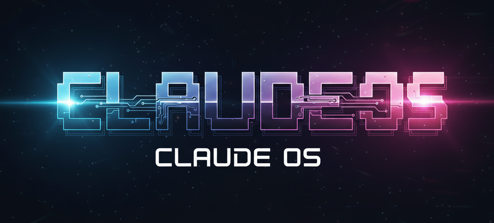
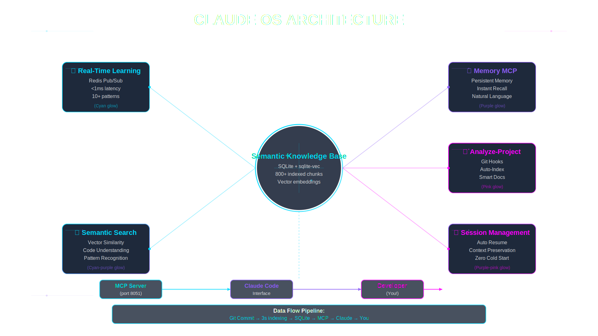

# Claude OS

<p align="center">
  
</p>

<p align="center">
  <strong>AI Memory & Knowledge Base System for Claude Code</strong><br>
  Share with your team • Initialize projects in seconds • Never lose context again
</p>

<p align="center">
  <a href="#license"></a>
  <a href="https://www.python.org/downloads/"></a>
  <a href="https://www.sqlite.org/"></a>
  <a href="https://ollama.ai/"></a>
</p>

<p align="center">
  <a href="https://thebob.dev/claude-os/">
    
  </a>
</p>

---

## 🚀 What is Claude OS?

**Claude OS** is **Claude Code's personal memory system** - making AI the best coding assistant in the universe by remembering everything across sessions.

### The Problem

You work with Claude Code on a feature, close the terminal, come back tomorrow... and Claude forgot everything. You explain the same architecture. You reference the same files. You repeat yourself constantly.

### The Solution

**Claude OS gives Claude persistent memory:**

- 📝 **Remembers decisions** across all sessions
- 🔍 **Searches past work** automatically at session start
- 📚 **Indexes your docs** and makes them searchable
- 🧠 **Learns patterns** that improve over time
- 🤝 **Shares with your team** - one install, unlimited projects

### Key Features

✅ **Lightning-Fast Indexing** - NEW! Tree-sitter hybrid indexing: 10,000 files in 30 seconds (vs 3-5 hours)
✅ **One-Command Project Init** - `/claude-os-init` and you're done
✅ **Automatic Context Loading** - Starts every session with relevant memories
✅ **Session Management** - Track work, save progress, resume later
✅ **Documentation Ingestion** - Auto-indexes your docs during setup
✅ **Agent-OS Integration** - Optional spec-driven development with 8 specialized agents
✅ **Flexible AI** - Choose local Ollama (free) or OpenAI API (paid)
✅ **Team Sharing** - `./install.sh` for coworkers, works instantly
✅ **100% Local** - Never leaves your machine, fully private
✅ **Template System** - Commands and skills shared via symlinks

---

## ⚡ NEW: Hybrid Indexing System

**Claude OS v2.0 introduces lightning-fast tree-sitter based indexing!**

### The Problem with Traditional Indexing

Previous versions embedded EVERY file, which was painfully slow for large codebases:
- **Pistn project (10,000 Ruby files):** 3-5 hours to index
- Must complete before Claude can start working
- High resource usage, blocks productive coding

### The Solution: Hybrid Two-Phase Indexing

Inspired by [Aider's](https://github.com/Aider-AI/aider) approach, Claude OS now uses:

**Phase 1: Structural Index (30 seconds)**
- ⚡ Parse files with tree-sitter (no LLM calls!)
- 📊 Extract symbols only (classes, functions, signatures)
- 🔗 Build dependency graph
- 🏆 PageRank importance scoring
- ✅ Ready to code immediately!

**Phase 2: Semantic Index (optional, background)**
- 🎯 Selective embedding (top 20% most important files)
- 📚 Full embedding for documentation
- 🔍 Deep semantic search when needed
- ⏰ Runs in background while you code

### Performance Comparison

| Feature | Before | After (Hybrid) |
|---------|--------|----------------|
| **Pistn (10k files)** | 3-5 hours | **30 seconds** + 20 min optional |
| **Files embedded** | 100,000+ chunks | ~20,000 chunks (80% reduction) |
| **Start coding** | After full index | **Immediately!** |
| **Resource usage** | High Ollama load | Minimal CPU/memory |
| **Query speed** | Semantic search | Instant structural + semantic |

📖 **Read the full design:** [docs/HYBRID_INDEXING_DESIGN.md](docs/HYBRID_INDEXING_DESIGN.md)

---

## 🏗️ Architecture Overview

<p align="center">
  
</p>

**Claude OS is built on 5 core pillars that work together to give Claude persistent memory:**

1. **🧠 Real-Time Learning** - Automatically captures insights from conversations via Redis Pub/Sub
2. **💾 Memory MCP** - Persistent memory system with instant recall using natural language
3. **🔍 Analyze-Project** - Intelligent codebase indexing with git hooks and tree-sitter
4. **🎯 Session Management** - Auto-resume sessions with full context preservation
5. **📚 Semantic Search** - Vector-based code understanding and pattern recognition

All knowledge flows through the **Semantic Knowledge Base** (SQLite + sqlite-vec), exposed via the **MCP Server** (port 8051) to **Claude Code**, giving you an AI assistant that never forgets.

**Data Flow:** `Git Commit → 3s indexing → SQLite → MCP → Claude → You`

---

## ⚡ Quick Start for Coworkers

**Your coworker shared Claude OS with you? Here's the 3-minute setup:**

### Step 1: Clone and Install

```bash
# Clone the repository
git clone https://github.com/your-team/claude-os.git
cd claude-os

# Run the installer (handles everything)
./install.sh
```

The installer will:

- ✅ Set up Python environment
- ✅ Install all dependencies
- ✅ Configure MCP server
- ✅ Symlink commands and skills to `~/.claude/`
- ✅ Optional: Install Agent-OS (8 agents by Builder Methods)
- ✅ Ask about AI provider (Ollama or OpenAI)
- ✅ Create start script

### Step 2: Start Claude OS

```bash
./start.sh
```

This starts the MCP server at `http://localhost:8051`

### Step 3: Initialize Your First Project

```bash
cd /path/to/your/project
```

In Claude Code, run:

```
/claude-os-init
```

Answer the questions (project name, tech stack, docs path, etc.) and **you're done!**

**What you get:**

- ✅ 4 knowledge bases created (memories, profile, index, docs)
- ✅ Documentation auto-indexed
- ✅ Codebase analyzed
- ✅ CLAUDE.md file with all context
- ✅ Ready to code with AI memory!

---

## 🎯 For First-Time Setup (Original Creator)

### Prerequisites

**Required:**

- Python 3.11+ (`python3 --version`)
- Git (`git --version`)

**Optional:**

- Node.js 16+ (for React UI)

### Installation

```bash
# 1. Clone the repository
git clone https://github.com/brobertsaz/claude-os.git
cd claude-os

# 2. Run the setup script
./setup.sh

# 3. Start all services
./start_all_services.sh
```

**The setup script automatically installs:**

- ✅ Ollama (if not present) + LLM models
- ✅ Redis (if not present) for caching/queues
- ✅ Python virtual environment
- ✅ All Python dependencies
- ✅ SQLite database
- ✅ Frontend dependencies (if Node.js present)

**Visit** <http://localhost:5173> to use the web UI.

### ⚠️ IMPORTANT: Consolidate Your Files (Required for Team Sharing)

**If you plan to share Claude OS with your team**, you MUST run the consolidation script after setup:

```bash
./cli/claude-os-consolidate.sh
```

**What this does:**
- Moves all commands from `~/.claude/commands/` to `templates/commands/`
- Moves all skills from `~/.claude/skills/` to `templates/skills/`
- Creates symlinks so your local environment still works
- Enables team members to install Claude OS with `./install.sh`

**Without consolidation:** Your coworkers' installations will be broken (symlinks will point to empty directories).

**Then commit to git:**

```bash
git add templates/ cli/ install.sh SHARING_GUIDE.md
git commit -m "Add packaging system for sharing"
git push
```

Now your team can clone and use `./install.sh`!

---

## 🎨 The `/claude-os-init` Command

**Initialize any project with Claude OS in under 2 minutes:**

### What It Does

```bash
cd /your/project
```

In Claude Code:

```
/claude-os-init
```

The command will:

1. **Ask Questions Interactively:**
   - Project name (auto-detects from folder)
   - Tech stack (Ruby on Rails, Python, Node.js, etc.)
   - Database (PostgreSQL, MySQL, etc.)
   - Development environment (Docker, Local, etc.)
   - Brief description
   - Documentation directory to ingest (optional)

2. **Create Project in Claude OS:**
   - Calls API to create project
   - Creates 4 knowledge bases automatically:
     - `{project}-project_memories` - Claude's memory
     - `{project}-project_profile` - Architecture & standards
     - `{project}-project_index` - Codebase index
     - `{project}-knowledge_docs` - Your documentation

3. **Set Up Project Structure:**

   ```
   your-project/
   ├── CLAUDE.md           # Auto-loaded every session!
   ├── .claude/            # Commands, skills, agents
   │   ├── ARCHITECTURE.md
   │   ├── CODING_STANDARDS.md
   │   └── DEVELOPMENT_PRACTICES.md
   └── .claude-os/         # Config and state (git-ignored)
       ├── config.json
       └── hooks.json
   ```

4. **Ingest Documentation:**
   - Scans your docs directory
   - Uploads all files to `{project}-knowledge_docs`
   - Creates vector embeddings for search

5. **Analyze Codebase:**
   - Runs `initialize-project` skill
   - Generates coding standards
   - Documents architecture
   - Indexes key files

6. **Ready to Code:**
   - Claude now knows your project
   - Memory persists across sessions
   - Context auto-loads on session start

---

## 🧠 How Claude OS Works

### Session Workflow

**Every Claude Code session automatically:**

1. **Checks for Active Session**
   - Reads `claude-os-state.json`
   - Prompts: Continue working? Start something new?

2. **Loads Context**
   - Searches `{project}-project_memories` for recent work
   - Loads relevant patterns and decisions
   - Shows what it remembers

3. **Works With Memory**
   - Saves insights with `/claude-os-remember`
   - Searches memories with `/claude-os-search`
   - References past decisions automatically

4. **Ends Session**
   - Saves session summary
   - Updates memories
   - Tracks what was accomplished

### Available Commands

All these work in any initialized project:

- **`/claude-os-init`** - Initialize new project
- **`/claude-os-search [query]`** - Search memories & docs
- **`/claude-os-remember [content]`** - Quick save to memories
- **`/claude-os-save [title]`** - Full-featured save with KB selection
- **`/claude-os-list`** - List all knowledge bases
- **`/claude-os-session [action]`** - Manage development sessions
- **`/claude-os-triggers`** - Manage trigger phrases

### Available Skills

- **`initialize-project`** - Analyze codebase and generate standards
- **`remember-this`** - Auto-save when you say "remember this:"
- **`memory`** - Simple memory management

---

## 🤖 Agent-OS: Spec-Driven Development (Optional)

> **Created by [Builder Methods (CasJam Media LLC)](https://github.com/builder-methods/agent-os)**
> MIT Licensed • Optional Integration with Claude OS

**Agent-OS adds structured workflows for planning and implementing features using 8 specialized agents.**

Claude OS optionally integrates with Agent-OS during installation. Agent-OS is a separate open-source project created by Builder Methods, and we're grateful for their work in creating such powerful spec-driven development tools.

### When to Use Agent-OS

Enable Agent-OS during `/claude-os-init` if you want:

- **Structured feature planning** with iterative requirements gathering
- **Detailed specifications** before coding
- **Task breakdowns** with clear implementation steps
- **Verification workflows** to ensure completeness

### The 8 Agents

**Specification Workflow:**

1. **`spec-initializer`** - Initialize new spec directories
2. **`spec-shaper`** - Gather requirements through 1-3 questions at a time
3. **`spec-writer`** - Create detailed technical specifications
4. **`tasks-list-creator`** - Break specs into actionable tasks

**Implementation Workflow:**

5. **`implementer`** - Implement features following task list
6. **`implementation-verifier`** - Verify implementation completeness
7. **`spec-verifier`** - Verify specs and tasks consistency
8. **`product-planner`** - Create product documentation

### Agent-OS Commands

Available when enabled:

- **`/new-spec`** - Initialize a new feature specification
- **`/create-spec`** - Full specification workflow (gather requirements → create spec → generate tasks)
- **`/plan-product`** - Create product mission, roadmap, and tech stack docs
- **`/implement-spec`** - Implement a specification following its tasks

### How It Works

```
1. User: "/new-spec user-authentication"
   → Agent creates spec directory structure

2. User: "/create-spec"
   → spec-shaper asks 1-3 questions at a time
   → Gathers requirements iteratively
   → Identifies reusable code
   → Collects visual assets

3. Agent: spec-writer creates detailed specification
   → tasks-list-creator generates actionable tasks

4. User: "/implement-spec user-authentication"
   → implementer follows tasks step-by-step
   → implementation-verifier checks completeness

5. Result: Fully specified, implemented, and verified feature!
```

### Agent-OS Project Structure

When enabled, your project gets:

```
your-project/
├── agent-os/
│   ├── config.yml          # Agent-OS configuration
│   ├── product/            # Product documentation
│   │   ├── mission.md      # Product mission
│   │   ├── roadmap.md      # Feature roadmap
│   │   └── tech-stack.md   # Technology stack
│   ├── specs/              # Feature specifications
│   │   └── YYYY-MM-DD-feature-name/
│   │       ├── planning/
│   │       │   ├── requirements.md
│   │       │   └── visuals/
│   │       ├── spec.md
│   │       └── tasks.md
│   └── standards/          # Coding standards (as skills)
└── .claude/agents/agent-os/  # 8 agents (symlinked)
```

### AI Provider Options

Agent-OS requires AI for advanced features:

**Option 1: Ollama (Local, Free)**

- Requires 8GB+ RAM
- Fully private, no data leaves your machine
- Install: `https://ollama.ai`
- Then: `ollama pull llama2`

**Option 2: OpenAI API (Cloud, Paid)**

- Works on any machine
- ~$0.02 per request
- Requires API key (set during `./install.sh`)

The installer will ask which you prefer!

### Integration with Claude OS

Agent-OS agents deeply integrate with Claude OS:

- **Search memories** before creating specs (avoid reinventing)
- **Save decisions** to project_memories during planning
- **Reference patterns** from previous work
- **Build knowledge** that improves over time

**This is the complete AI development system!**

---

## 🏗️ Architecture

```
┌─────────────────────────────────────────────────┐
│              Claude Code CLI                    │
│         (with Claude OS integration)            │
└───────────────────┬─────────────────────────────┘
                    │ MCP HTTP
┌───────────────────▼─────────────────────────────┐
│         MCP Server (Port 8051)                  │
│              FastAPI Backend                    │
└───────────────────┬─────────────────────────────┘
                    │
        ┌───────────┴────────────┐
        │                        │
┌───────▼────────────┐  ┌────────▼──────────┐
│   RAG Engine       │  │  React UI         │
│  (llama-index)     │  │  (Port 5173)      │
│  • Vector Search   │  │  • Project Mgmt   │
│  • Hybrid Search   │  │  • KB Browser     │
│  • Reranking       │  │  • Doc Upload     │
└───────┬────────────┘  └───────────────────┘
        │
┌───────▼────────────────────────────────────────┐
│   SQLite + sqlite-vec (Local Database)         │
│  • projects                                    │
│  • knowledge_bases                             │
│  • documents (with embeddings)                 │
│  • Single-file database                        │
└────────────────────────────────────────────────┘
        │
        └─────────────────────┐
                              │
                    ┌─────────▼──────┐
                    │  Ollama        │
                    │  (Port 11434)  │
                    │ • llama3.1     │
                    │ • Embeddings   │
                    └────────────────┘
```

### Template System

```
claude-os/
├── templates/              # Shared with all projects
│   ├── commands/          # Slash commands (symlinked to ~/.claude/)
│   │   ├── claude-os-init.md
│   │   ├── claude-os-search.md
│   │   └── ...
│   ├── skills/            # Skills (symlinked to ~/.claude/)
│   │   ├── initialize-project/
│   │   ├── remember-this/
│   │   └── memory/
│   └── project-files/     # Files created during /claude-os-init
│       ├── CLAUDE.md.template
│       └── .claude-os/
│           ├── config.json.template
│           └── hooks.json.template
├── cli/                   # CLI tools
│   └── claude-os-consolidate.sh
├── install.sh             # One-command setup for coworkers
└── start.sh               # Start services
```

**Benefits:**

- ✅ Update once, all projects benefit
- ✅ Symlinks mean instant updates
- ✅ Easy to share with team
- ✅ Consistent across projects

---

## 📚 Managing Knowledge Bases

### Via Web UI

1. **Visit** <http://localhost:5173>
2. **Create Knowledge Base:**
   - Click "Create Knowledge Base"
   - Choose type (Generic, Code, Documentation, Agent_OS)
3. **Upload Documents:**
   - Select KB from dropdown
   - Drag & drop files or click upload
   - Supports .md, .txt, .pdf, .py, .js, .ts, .json, .yaml
4. **Query:**
   - Type question in search box
   - View answer with source citations

### Via CLI

```bash
# Search your project memories
/claude-os-search "how did we implement authentication?"

# Save a quick insight
/claude-os-remember "Fixed bug in user controller by adding validation"

# Full-featured save
/claude-os-save "Authentication Pattern" my-app-project_profile Architecture
```

### Auto-Created KBs

When you run `/claude-os-init`, you get 4 knowledge bases:

1. **`{project}-project_memories`**
   - Claude's memory for decisions, patterns, solutions
   - Automatically saved during sessions
   - Searched at session start

2. **`{project}-project_profile`**
   - Architecture, coding standards, practices
   - Generated by `initialize-project` skill
   - Updated as project evolves

3. **`{project}-project_index`**
   - Automated codebase index
   - Tracks file structure
   - Updates on git commits (with hooks)

4. **`{project}-knowledge_docs`**
   - Your documentation
   - Auto-ingested during init
   - Add more via UI or CLI

---

## 🤝 Team Collaboration

### Sharing Claude OS

**Step 1: Package for sharing**

```bash
cd /path/to/claude-os
./cli/claude-os-consolidate.sh  # Move files to templates/
git add templates/ cli/ install.sh
git commit -m "Ready for team sharing"
git push
```

**Step 2: Share repo URL with team**

Send teammates:

- Repo URL
- Link to `SHARING_GUIDE.md` in the repo

**Step 3: They install (3 minutes)**

```bash
git clone <your-repo-url>
cd claude-os
./install.sh
./start.sh
```

Done! They can now use `/claude-os-init` on any project.

### Per-Project Setup

Each team member:

1. Runs `/claude-os-init` in their project
2. Gets their own knowledge bases
3. CLAUDE.md is committed to git (shared)
4. .claude-os/ state is git-ignored (personal)

**Result:** Team shares context via CLAUDE.md, but each person has their own AI memory.

---

## ⚙️ Configuration

### Environment Variables

```bash
# SQLite Database
SQLITE_DB_PATH=data/claude-os.db  # Default: data/claude-os.db

# Ollama
OLLAMA_HOST=http://localhost:11434  # Default: localhost:11434
OLLAMA_MODEL=llama3.1:latest        # Default: llama3.1:latest

# MCP Server
MCP_SERVER_HOST=0.0.0.0         # Default: 0.0.0.0
MCP_SERVER_PORT=8051            # Default: 8051
```

### Project Configuration

Each project has `.claude-os/config.json`:

```json
{
  "project_name": "my-app",
  "claude_os_url": "http://localhost:8051",
  "knowledge_bases": {
    "memories": "my-app-project_memories",
    "profile": "my-app-project_profile",
    "index": "my-app-project_index",
    "docs": "my-app-knowledge_docs"
  },
  "docs_settings": {
    "watch_paths": ["./docs", "./knowledge_docs"],
    "auto_ingest_patterns": ["*.md", "*.txt", "*.pdf"]
  },
  "tech_stack": "Ruby on Rails",
  "database": "MySQL"
}
```

---

## 📊 Performance

**Native Ollama Setup:**

- Response time: ~40 seconds per query
- GPU acceleration: Full Metal GPU on Apple Silicon
- Memory usage: 8-10GB (models + context)
- CPU usage: 12 cores (M4 Pro)

**Why it's fast:**

- Direct GPU acceleration (no virtualization)
- Efficient vector search in SQLite
- Optimized RAG engine with caching
- Single-file database with minimal overhead

---

## 🛠️ Scripts Guide

### Installation & Setup

#### `./install.sh` - Team Member Setup ⭐

```bash
./install.sh
```

**For coworkers joining the team:**

- ✅ Creates `~/.claude/` directories
- ✅ Symlinks all commands and skills
- ✅ Sets up Python environment
- ✅ Installs dependencies
- ✅ Configures MCP server

#### `./setup.sh` - First-Time Setup

```bash
./setup.sh
```

**For the original creator:**

- ✅ Installs Ollama + Redis (if needed)
- ✅ Downloads LLM models (~5-10 GB)
- ✅ Sets up Python environment
- ✅ Creates database

#### `./cli/claude-os-consolidate.sh` - Organize Files

```bash
./cli/claude-os-consolidate.sh
```

**One-time consolidation:**

- Moves commands to `templates/`
- Moves skills to `templates/`
- Creates symlinks
- Prepares for git commit

### Service Management

#### `./start.sh` or `./start_all_services.sh` - Start Everything

```bash
./start.sh
```

**Starts:**

- 🔌 MCP Server (port 8051)
- 🎨 React Frontend (port 5173)
- 🤖 RQ Workers
- 💾 Redis
- 🧠 Ollama

#### `./stop_all_services.sh` - Stop All

```bash
./stop_all_services.sh
```

#### `./restart_services.sh` - Restart

```bash
./restart_services.sh
```

---

## 🐛 Troubleshooting

### "Command not found: /claude-os-init"

Symlinks weren't created. Re-run:

```bash
cd /path/to/claude-os
./install.sh
```

### "Connection refused to localhost:8051"

Claude OS server isn't running:

```bash
cd /path/to/claude-os
./start.sh
```

### "Project already exists"

Project name is taken. Choose a different name or delete via UI at <http://localhost:5173>

### Port Already in Use

```bash
# Find process on port 8051
lsof -i :8051

# Kill if needed
kill -9 <PID>
```

### Ollama Issues

```bash
# Check if running
ollama list

# Start manually
ollama serve

# Check for model
ollama list | grep llama3.1
```

---

## 📁 Project Structure

```
claude-os/
├── templates/              # NEW: Shared templates system
│   ├── commands/          # Slash commands
│   ├── skills/            # Skills
│   └── project-files/     # Files created during init
├── cli/                   # NEW: CLI tools
│   └── claude-os-consolidate.sh
├── app/                    # Backend application
│   ├── core/              # Core modules
│   │   ├── sqlite_manager.py
│   │   ├── rag_engine.py
│   │   └── ...
│   └── db/                # Database schemas
├── frontend/              # React UI (Vite)
│   ├── src/
│   └── public/
│       └── assets/
│           └── claude-os-hero.png
├── mcp_server/           # MCP Server (HTTP)
│   └── server.py         # FastAPI + MCP endpoints
├── data/                 # SQLite database
│   └── claude-os.db
├── logs/                 # Service logs
├── install.sh            # NEW: Coworker setup
├── start.sh              # NEW: Start services
├── SHARING_GUIDE.md      # NEW: Team sharing docs
└── README.md             # This file
```

---

## 📖 Additional Documentation

### Getting Started

- **[SHARING_GUIDE.md](SHARING_GUIDE.md)** - 🤝 How to share with your team
- **[templates/README.md](templates/README.md)** - 📂 Template system documentation

### Core Features

- **[docs/SELF_LEARNING_SYSTEM.md](docs/SELF_LEARNING_SYSTEM.md)** - 🧠 How Claude learns automatically
- **[docs/REAL_TIME_LEARNING_GUIDE.md](docs/REAL_TIME_LEARNING_GUIDE.md)** - Real-time learning usage
- **[docs/MEMORY_MCP_GUIDE.md](docs/MEMORY_MCP_GUIDE.md)** - Persistent memory guide

### Technical Documentation

- **[docs/API_REFERENCE.md](docs/API_REFERENCE.md)** - 🔌 **Complete API Reference** (all endpoints, examples, authentication)
- **[docs/HYBRID_INDEXING_DESIGN.md](docs/HYBRID_INDEXING_DESIGN.md)** - ⚡ Hybrid indexing architecture
- **[README_NATIVE_SETUP.md](README_NATIVE_SETUP.md)** - Detailed native setup
- **[NATIVE_VS_DOCKER_DECISION.md](NATIVE_VS_DOCKER_DECISION.md)** - Why native Ollama
- **[PERFORMANCE_TEST_RESULTS.md](PERFORMANCE_TEST_RESULTS.md)** - Benchmark results

---

## 🤝 Contributing

This is a team development tool. Feel free to:

- Modify for your specific needs
- Add new commands and skills
- Optimize RAG strategies
- Contribute improvements back

---

## 🙏 Acknowledgments

**Agent-OS Integration**

Claude OS optionally integrates with [Agent-OS](https://github.com/builder-methods/agent-os) by Builder Methods (CasJam Media LLC).

- **Project**: Agent-OS - Spec-driven development workflow system
- **Author**: Builder Methods (CasJam Media LLC)
- **License**: MIT
- **Repository**: <https://github.com/builder-methods/agent-os>

Agent-OS provides 8 specialized agents for structured feature planning and implementation. We're grateful to Builder Methods for creating such powerful tools and for licensing them under MIT, making this integration possible.

If you find Agent-OS valuable, consider:

- ⭐ Starring their repository
- 📣 Sharing it with other developers
- 🤝 Contributing to their project

---

## 📄 License

MIT License - Use it freely!

**Note**: This project (Claude OS) is MIT licensed. Agent-OS, when installed, is a separate project also MIT licensed by Builder Methods (CasJam Media LLC). See the Agent-OS repository for their specific license terms.

---

## 🎯 Next Steps

### For Original Creator

1. Run `./setup.sh` (first time)
2. Run `./cli/claude-os-consolidate.sh` (organize files)
3. Commit templates to git
4. Share repo with team

### For Team Members

1. Clone the repo
2. Run `./install.sh`
3. Run `./start.sh`
4. Use `/claude-os-init` in your projects

### For Everyone

- Use `/claude-os-search` to find past work
- Use `/claude-os-remember` to save insights
- Use `/claude-os-session` to track work
- Enjoy never losing context again!

---

<p align="center">
  <strong>Claude Code + Claude OS = Invincible! 🚀</strong><br>
  <em>Built by AI coders, for AI coders</em>
</p>
