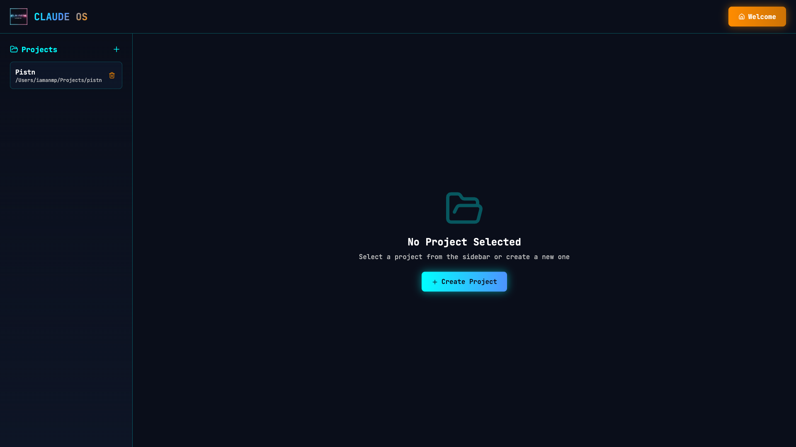
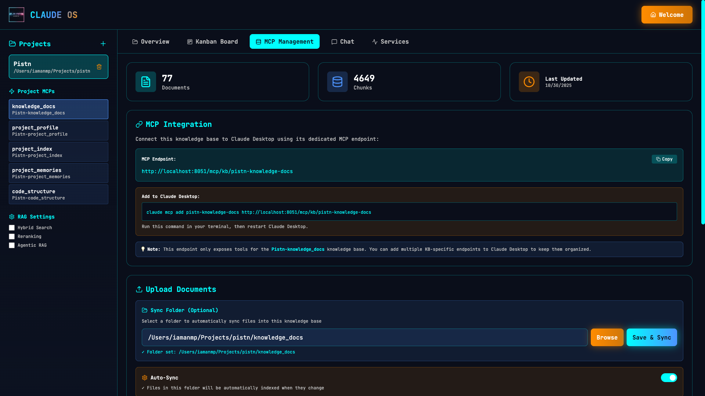
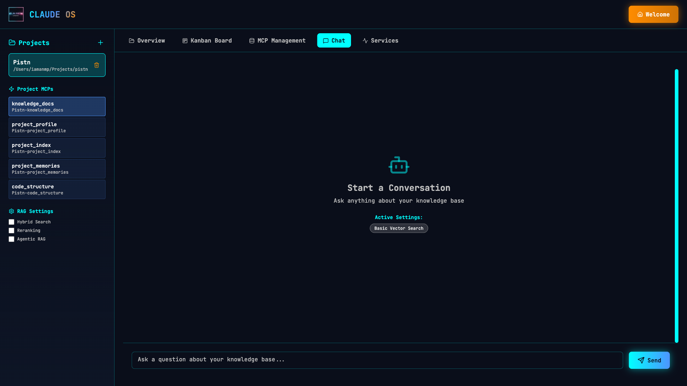
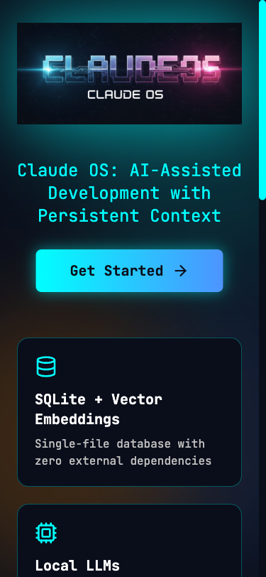

# Claude OS Visual Guide

**A complete visual tour of the Claude OS interface**

---

## 📸 Full Application Tour

### 1. Welcome Screen


**What you see:**
- Claude OS hero image and branding
- Quick start guide
- Links to documentation
- Get started button

**What you can do:**
- Learn about Claude OS features
- Access documentation
- Navigate to the main application

---

### 2. Projects List



**What you see:**
- All your Claude OS projects
- Project names and paths
- Quick actions (delete, configure)
- Create new project button

**What you can do:**
- View all projects
- Select a project to work with
- Create new projects
- Delete old projects
- See project metadata

**Key Features:**
- ✅ Fast project switching
- ✅ Visual project cards
- ✅ Quick project creation
- ✅ Project organization

---

### 3. Project Overview


**What you see:**
- Project name and description
- Database ID
- Project path
- MCP configuration status (X of 5 MCPs)
- List of configured MCPs:
  - knowledge_docs
  - project_profile
  - project_index
  - project_memories
  - code_structure

**What you can do:**
- View project details
- Check MCP configuration
- Access configure button
- See which MCPs are set up
- Understand project structure

**Key Features:**
- ✅ Complete project metadata
- ✅ MCP status at a glance
- ✅ Configuration access
- ✅ Visual MCP indicators (configured vs not configured)

---

### 4. Kanban Board


**What you see:**
- Project specs organized as Kanban boards
- Progress bars for each spec
- Task counts by status (Todo/In Progress/Done/Blocked)
- Sync specs button
- Show archived toggle
- Summary statistics:
  - Total specs
  - Total tasks
  - Completion percentage

**What you can do:**
- View all active specs
- See task progress visually
- Click tasks to view details
- Update task status
- Archive completed specs
- Sync new specs from agent-os folder
- Track implementation progress

**Key Features:**
- ✅ Visual progress tracking
- ✅ Real-time task management
- ✅ Archive completed work
- ✅ Automatic sync from agent-os
- ✅ Progress percentages
- ✅ Task organization by phase

**Perfect for:**
- Tracking Agent-OS spec implementation
- Visualizing project progress
- Managing task workflow
- Team collaboration
- Sprint planning

---

### 4.5. Task Detail Modal



**What you see:**
- Task code and title
- Full task description
- Current status
- Time estimates (estimated vs actual)
- Risk level
- Dependencies
- Status update buttons

**What you can do:**
- View complete task details
- Update task status (Todo → In Progress → Done → Blocked)
- Track time spent vs estimated
- See task dependencies
- Close modal to return to Kanban board

**Key Features:**
- ✅ Quick status updates
- ✅ Time tracking
- ✅ Risk visibility
- ✅ Dependency awareness
- ✅ Clean modal interface

---

### 6. MCP Management


**What you see:**
- Selected MCP knowledge base
- Document list
- Upload interface
- Search functionality
- KB statistics

**What you can do:**
- Browse documents in knowledge base
- Upload new documents (.md, .txt, .pdf, code files)
- Search across KB
- View KB stats
- Manage knowledge base content

**Key Features:**
- ✅ Drag & drop file upload
- ✅ Multi-file support
- ✅ Document browser
- ✅ Search within KB
- ✅ File type indicators

**Supported Knowledge Bases:**
- **project_memories** - Your decisions and insights
- **project_profile** - Coding standards and architecture
- **project_index** - Automated codebase index
- **knowledge_docs** - Documentation and guides
- **code_structure** - Tree-sitter structural index

---

### 7. Chat Interface



**What you see:**
- Chat conversation with Claude
- Message history
- Input field
- RAG settings:
  - Hybrid Search toggle
  - Reranking toggle
  - Agentic RAG toggle

**What you can do:**
- Ask questions about your project
- Search knowledge bases conversationally
- Get AI-powered answers with citations
- Adjust search strategies
- Reference past conversations

**Key Features:**
- ✅ Natural language queries
- ✅ Semantic search across KBs
- ✅ Source citations
- ✅ Customizable RAG strategies
- ✅ Context-aware responses

**RAG Settings:**
- **Hybrid Search** - Combines semantic + keyword search
- **Reranking** - Re-orders results for better relevance
- **Agentic RAG** - AI-powered query refinement

---

### 8. Services Dashboard


**What you see:**
- All Claude OS services status
- Service health indicators (Running/Stopped)
- Individual service cards:
  - MCP Server (port 8051)
  - Frontend Server (port 5173)
  - RQ Worker
  - File Watcher
  - Redis
  - Ollama

**What you can do:**
- Monitor service health
- See which services are running
- Check service ports
- Identify issues quickly
- Verify complete stack status

**Key Features:**
- ✅ Real-time service monitoring
- ✅ Visual status indicators
- ✅ Port information
- ✅ Service descriptions
- ✅ Quick health check

**Service Details:**

| Service | Purpose | Port |
|---------|---------|------|
| **MCP Server** | FastAPI backend, knowledge base APIs | 8051 |
| **Frontend** | React UI (Vite dev server) | 5173 |
| **RQ Worker** | Background job processing | - |
| **File Watcher** | Auto-sync knowledge_docs folders | - |
| **Redis** | Cache & job queue | 6379 |
| **Ollama** | Local LLM inference | 11434 |

---

### 9. Mobile Experience



**What you see:**
- Responsive mobile interface
- Optimized navigation
- Touch-friendly controls
- Mobile-optimized layouts

**What you can do:**
- Access Claude OS from any device
- Use all features on mobile
- Responsive design adapts to screen size
- Full functionality on tablets and phones

**Key Features:**
- ✅ Fully responsive design
- ✅ Touch-optimized UI
- ✅ Mobile navigation
- ✅ All features accessible on mobile
- ✅ Supports all modern mobile browsers

**Supported Devices:**
- 📱 iPhone (iOS 14+)
- 📱 Android phones
- 📱 Tablets (iPad, Android)
- 💻 Any screen size from 375px to 1920px+

---

## 🎯 Navigation Flow

### Typical Workflow

```
1. Welcome Screen
   ↓
2. Projects List → Select/Create Project
   ↓
3. Project Overview → See MCP Status
   ↓
4. Choose a Tab:
   ├─→ Kanban Board (track implementation)
   ├─→ MCP Management (upload docs)
   ├─→ Chat (ask questions)
   └─→ Services (monitor health)
```

### Quick Access Paths

**To track spec progress:**
```
Projects List → Select Project → Kanban Board Tab
```

**To upload documentation:**
```
Projects List → Select Project → MCP Management → Select KB → Upload
```

**To ask project questions:**
```
Projects List → Select Project → Chat Tab
```

**To check service health:**
```
Projects List → Select Project → Services Tab
```

---

## 🎨 UI Components

### Common Elements

**Sidebar (Left):**
- Projects list
- Project MCPs
- RAG settings
- Quick actions

**Top Navigation:**
- Home button
- Project name
- Tab navigation
- Welcome link

**Main Content:**
- Tab-specific content
- Interactive elements
- Real-time data

**Status Indicators:**
- ✅ Green = Success/Active
- ⏸️ Yellow = Paused
- ❌ Red = Error/Stopped
- 📊 Blue = In Progress

---

## 📱 Responsive Design

All pages are designed to work on:
- 💻 Desktop (1920px+)
- 💻 Laptop (1440px)
- 📱 Tablet (768px)
- 📱 Mobile (375px+)

**Optimized for:**
- Chrome
- Firefox
- Safari
- Edge

---

## 🎯 Feature Highlights by Page

### Welcome Screen
- First-time user onboarding
- Feature introduction
- Documentation access

### Projects List
- Multi-project management
- Quick project switching
- Project creation wizard

### Project Overview
- At-a-glance project status
- MCP configuration visibility
- Quick configuration access

### Kanban Board
- Visual task management
- Progress tracking
- Spec implementation workflow
- Archive management

### MCP Management
- Knowledge base content management
- Document upload
- KB organization

### Chat Interface
- Natural language queries
- Semantic search
- AI-powered answers

### Services Dashboard
- System health monitoring
- Service status visibility
- Quick diagnostics

---

## 🚀 Getting Started

**For new users:**

1. Start at **Welcome Screen** → Learn about features
2. Go to **Projects List** → Create your first project
3. View **Project Overview** → See MCP setup
4. Visit **MCP Management** → Upload documentation
5. Try **Chat** → Ask questions about your docs
6. Check **Kanban** → Track spec implementation
7. Monitor **Services** → Ensure everything running

**For experienced users:**

1. **Projects List** → Select project
2. **Kanban** → Continue implementation
3. **Chat** → Quick questions as needed
4. **Services** → Occasional health check

---

## 📖 Related Documentation

- **[README.md](../../README.md)** - Complete setup guide
- **[WHAT_IS_CLAUDE_OS.md](./WHAT_IS_CLAUDE_OS.md)** - Feature overview
- **[KANBAN_BOARD_GUIDE.md](./KANBAN_BOARD_GUIDE.md)** - Kanban detailed guide
- **[SESSION_START_PROTOCOL.md](./SESSION_START_PROTOCOL.md)** - Session management
- **[API_REFERENCE.md](../API_REFERENCE.md)** - Complete API docs

---

**This visual guide shows the complete Claude OS interface. Every screenshot is from the actual application running with real project data!** 🎉
